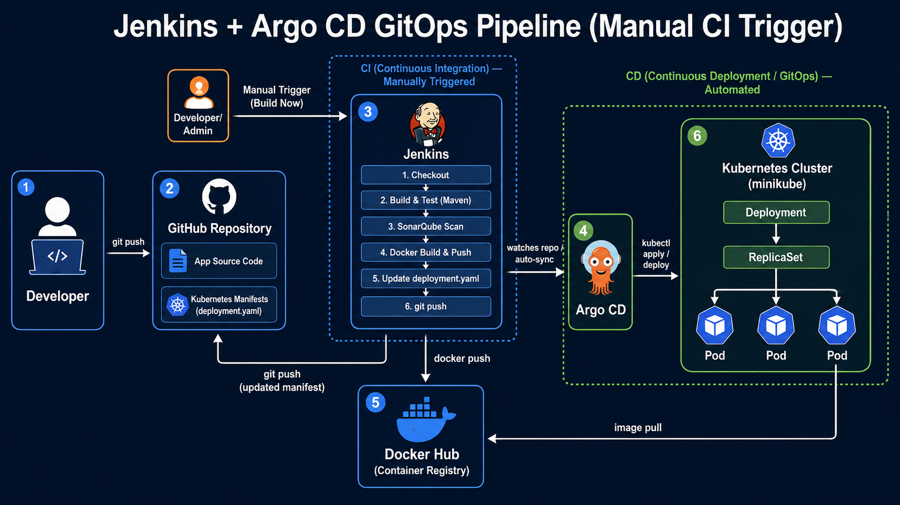

# Spring Boot App — Jenkins + ArgoCD GitOps Pipeline

A step-by-step guide to set up a full CI/CD pipeline: **Jenkins** (build, test, scan, containerize, push) → **GitHub** (manifest source of truth) → **Argo CD** (GitOps deployment) → **Kubernetes (minikube)**.

---

## Architecture Diagram



---

## Architecture Overview

```
Developer push → GitHub (app code)
      ↓
Jenkins: checkout → build/test → SonarQube scan → docker build/push → update deployment.yaml → push to GitHub
      ↓
Argo CD: watches GitHub repo (manifests) → detects change → auto-syncs
      ↓
Kubernetes (minikube): pulls new image → rolling update → new pods running
```

Jenkins never talks to Kubernetes directly — it only updates a YAML manifest in Git. Argo CD is solely responsible for deployment. This keeps CI and CD cleanly separated.

---

## Prerequisites

- Docker Desktop (or Docker Engine) installed and running
- [minikube](https://minikube.sigs.k8s.io/docs/start/) installed
- `kubectl` installed
- Jenkins installed (locally, in Docker, or on a VM)
- A GitHub account + repo for this project
- A Docker Hub account
- Java 17+ and Maven installed on the Jenkins agent (for `mvn` commands)
- (Optional) [ngrok](https://ngrok.com/) if you want GitHub webhooks to reach a local Jenkins instance

---

## Step 1 — Start minikube

```bash
minikube start
minikube status
kubectl get nodes
```

Enable the dashboard (optional, useful for visual debugging):
```bash
minikube dashboard
```

---

## Step 2 — Install and Configure Jenkins

### 2.1 Install Jenkins
- Windows: download the `.msi` installer from [jenkins.io](https://www.jenkins.io/download/) and run it.
- Or run via Docker:
  ```bash
  docker run -d -p 8080:8080 -p 50000:50000 --name jenkins \
    -v jenkins_home:/var/jenkins_home jenkins/jenkins:lts
  ```
- Get the initial admin password:
  ```bash
  docker exec jenkins cat /var/jenkins_home/secrets/initialAdminPassword
  ```
- Visit `http://localhost:8080`, unlock Jenkins, install **suggested plugins**.

### 2.2 Install required Jenkins plugins
Go to **Manage Jenkins → Plugins → Available plugins**, install:
- Docker Pipeline
- Git
- GitHub Integration / GitHub
- SonarQube Scanner
- Credentials Binding
- Pipeline: Stage View (optional, nicer UI)

Restart Jenkins after installing.

### 2.3 Configure global tools (if needed)
**Manage Jenkins → Tools**:
- Add a Maven installation (or ensure `mvn` is on the agent's PATH).
- Add a Docker installation if using the Docker Pipeline plugin's tool auto-install.

---

## Step 3 — Manage Credentials in Jenkins

Go to **Manage Jenkins → Credentials → System → Global credentials → Add Credentials** for each of the following:

### 3.1 GitHub credential (`docker-cred` style, used for `git push`)
- Kind: **Secret text** (if using a Personal Access Token) or **Username with password**
- Generate a token: GitHub → Settings → Developer settings → Personal access tokens → Fine-grained token with **repo** write access.
- ID: `github` (must match the `credentialsId` used in the Jenkinsfile: `withCredentials([string(credentialsId: 'github', ...)])`)

### 3.2 Docker Hub credential
- Kind: **Username with password**
- Username: your Docker Hub username
- Password: a Docker Hub [access token](https://hub.docker.com/settings/security) (recommended over your real password)
- ID: `docker-cred` (matches `docker.withRegistry('https://index.docker.io/v1/', 'docker-cred')`)

### 3.3 SonarQube token
- Kind: **Secret text**
- Value: token generated from SonarQube → My Account → Security → Generate Token
- ID: `sonarqube` (matches `credentialsId: 'sonarqube'`)

> All three IDs above must exactly match the `credentialsId` strings already referenced in the Jenkinsfile.

---

## Step 4 — Install and Configure SonarQube

### 4.1 Run SonarQube locally (Docker is easiest)
```bash
docker run -d --name sonarqube -p 9000:9000 sonarqube:lts-community
```
Visit `http://localhost:9000`, log in with default `admin` / `admin`, change the password.

### 4.2 Generate a token
My Account → Security → Generate Tokens → copy the token → paste it into the Jenkins `sonarqube` credential (Step 3.3).

### 4.3 (Optional) Configure SonarQube server in Jenkins
**Manage Jenkins → System → SonarQube servers** → add a server named to match your pipeline, with URL `http://localhost:9000` and the saved token credential. This lets you use `withSonarQubeEnv()` instead of manually passing `-Dsonar.host.url`.

---

## Step 5 — Create the Jenkins Pipeline Job

1. Jenkins Dashboard → **New Item** → name it (e.g. `spring-boot-pipeline`) → select **Pipeline** → OK.
2. Under **Pipeline** section:
   - Definition: **Pipeline script from SCM**
   - SCM: **Git**
   - Repository URL: your GitHub repo URL
   - Branch: `*/main`
   - Script Path: `Jenkinsfile` (or wherever your Jenkinsfile lives)
3. Save.

---

## Step 6 — Enable Automatic Triggering (push → build)

Pushing to GitHub does **not** trigger Jenkins automatically unless you configure a trigger.

### Option A — Poll SCM (recommended for local Jenkins, no public URL needed)
Job → **Configure → Build Triggers → Poll SCM**:
```
H/5 * * * *
```
Jenkins checks GitHub every 5 minutes and builds if there's a new commit.

### Option B — GitHub Webhook (instant, needs Jenkins reachable from the internet)
1. Expose Jenkins publicly, e.g.:
   ```bash
   ngrok http 8080
   ```
2. Job → **Configure → Build Triggers** → check **"GitHub hook trigger for GITScm polling"**.
3. GitHub repo → **Settings → Webhooks → Add webhook**:
   - Payload URL: `https://<ngrok-or-public-url>/github-webhook/`
   - Content type: `application/json`
   - Event: "Just the push event"
4. Save. Every push now triggers Jenkins instantly.

---

## Step 7 — Install Argo CD on minikube

### 7.1 Create namespace and install
```bash
kubectl create namespace argocd
kubectl apply -n argocd -f https://raw.githubusercontent.com/argoproj/argo-cd/stable/manifests/install.yaml
```

### 7.2 Wait for pods to be ready
```bash
kubectl get pods -n argocd -w
```

### 7.3 Access the Argo CD UI
```bash
kubectl port-forward svc/argocd-server -n argocd 8443:443
```
Visit `https://localhost:8443` (accept the self-signed cert warning).

### 7.4 Get the initial admin password
```bash
kubectl -n argocd get secret argocd-initial-admin-secret \
  -o jsonpath="{.data.password}" | base64 -d
```
Username: `admin`. Log in and change the password (Argo CD CLI: `argocd account update-password`).

### 7.5 (Optional) Install Argo CD CLI
```bash
brew install argocd        # macOS
choco install argocd-cli   # Windows
```

---

## Step 8 — Create the Argo CD Application

Either via UI (**+ New App**) or CLI:

```bash
argocd app create spring-boot-apps \
  --repo https://github.com/<your-username>/<your-repo>.git \
  --path spring-boot-app-manifests \
  --dest-server https://kubernetes.default.svc \
  --dest-namespace default \
  --sync-policy automated \
  --self-heal \
  --auto-prune
```

Key fields:
- `--repo`: the GitHub repo Jenkins pushes the updated `deployment.yaml` to
- `--path`: folder containing your Kubernetes manifests
- `--sync-policy automated`: enables auto-sync so Argo CD deploys as soon as it detects a Git change
- `--self-heal`: reverts manual cluster changes back to match Git
- `--auto-prune`: removes resources deleted from Git

Verify:
```bash
argocd app get spring-boot-apps
```

---

## Step 9 — Verify the Full Loop

1. Make a small code change and push to GitHub.
2. Jenkins triggers (via poll or webhook) → runs all stages → builds and pushes a new Docker image tagged with the build number → updates `deployment.yaml` → pushes to GitHub.
3. Argo CD detects the new commit within its sync interval (default ~3 min, or instantly if using a Git webhook to Argo CD too) → auto-syncs.
4. Check rollout:
   ```bash
   kubectl get rs -n default
   kubectl get pods -n default
   kubectl rollout status deployment/spring-boot-apps -n default
   ```
5. Confirm in the Argo CD UI: **App Health = Healthy**, **Sync Status = Synced**.

---

## Step 10 — (Optional) Speed up Argo CD sync with a Git webhook

By default Argo CD polls Git every 3 minutes. For near-instant sync after Jenkins pushes:

1. GitHub repo → Settings → Webhooks → Add webhook:
   - Payload URL: `https://<argocd-server>/api/webhook`
   - Content type: `application/json`
2. This notifies Argo CD immediately on push instead of waiting for the next poll.

---

## Troubleshooting Checklist

| Symptom | Likely Cause | Fix |
|---|---|---|
| `ImagePullBackOff` / `manifest unknown` | `deployment.yaml` still has a placeholder tag | Ensure the "Update Deployment File" stage actually substitutes `%BUILD_NUMBER%` before commit |
| Jenkins doesn't build after push | No trigger configured | Add Poll SCM or GitHub webhook (Step 6) |
| Argo CD shows `OutOfSync` forever | Auto-sync disabled, or repo/path misconfigured | Check `--sync-policy automated`, verify repo URL and path |
| SonarQube stage fails auth | Wrong/expired token | Regenerate token, update the `sonarqube` credential in Jenkins |
| `docker push` fails | Docker Hub credential invalid or repo doesn't exist | Verify `docker-cred`, confirm the image repo exists/is public under your Docker Hub account |
| `git push` fails in pipeline | GitHub token expired or lacks repo write scope | Regenerate token with `repo` scope, update `github` credential |

---

## Repo Structure Reference

```
.
├── Jenkinsfile
├── spring-boot-app/                  # application source + Dockerfile
└── spring-boot-app-manifests/
    └── deployment.yaml               # watched by Argo CD
```
